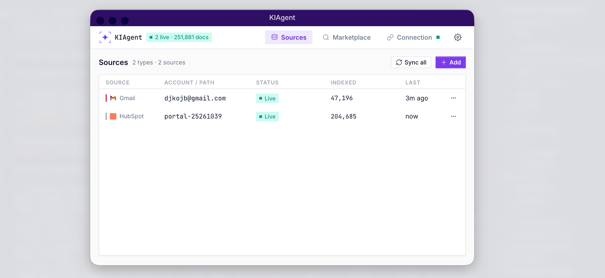
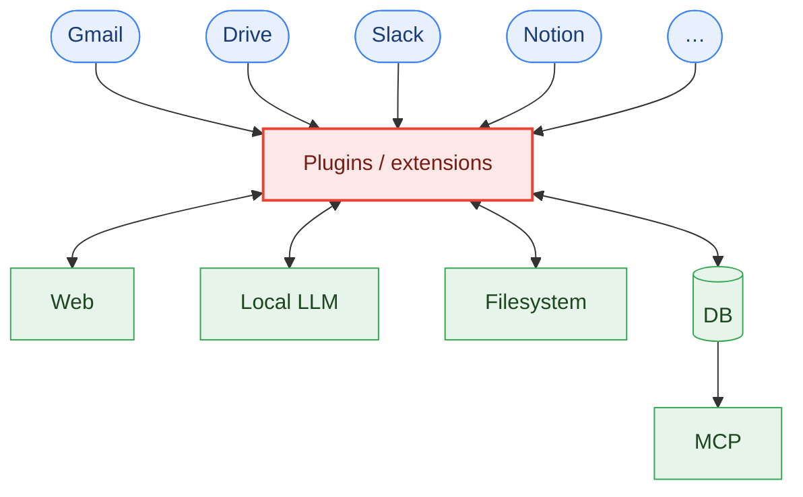

<p align="center">
  
</p>

<h1 align="center">KIAgent</h1>

<p align="center"><strong>Your knowledge, indexed locally.</strong></p>

<p align="center">
  <a href="https://localkiagent.com/">Website</a> ·
  <a href="https://localkiagent.com/download">Download</a> ·
  <a href="docs/architecture">Architecture docs</a>
</p>

<p align="center">
  <a href="LICENSE"></a>
  <a href="https://localkiagent.com/download"></a>
</p>

<!-- TODO: replace with a real screenshot, then uncomment:
<p align="center">
  
</p>
-->

KIAgent is a desktop app that ingests your personal data — mail, documents, chats, notes — on your own machine, stores it in a local database, and serves it to AI assistants over [MCP](https://modelcontextprotocol.io). Everything stays on your computer: ingestion, parsing, OCR and vision all run locally, so your AI assistant can know your data without your data ever leaving your machine.

At its core, KIAgent is a **platform**: a small set of host capabilities (MCP, database, local LLM, filesystem, web access) wired together by an ingestion engine, plus a plugin/extension system that lets sandboxed connectors use those capabilities to bring in new data sources.



Plugins sit at the center: each one connects to a third-party service (Gmail, Drive, Slack, Notion, ...) or the local filesystem, pulls your data in, uses the local LLM to process it, and lands it in the database — which MCP then serves to AI assistants. Access is mediated and permission-gated; plugins never touch these capabilities directly.

## Get KIAgent

If you just want to use the app, download a signed installer from **[localkiagent.com/download](https://localkiagent.com/download)** — no build step required. Installers are available for macOS, Windows and Linux.

## This repo: kiagent-core

This repository is the MIT-licensed core that KIAgent is built from, in the same spirit as VS Code and Code-OSS:

- **kiagent-core** (this repo) — the open-source core. `npm run package:oss` produces an unbranded `kiagent-core` build you can run and redistribute under the MIT license.
- **[KIAgent](https://localkiagent.com/)** — the branded, signed product built from this core and distributed at [localkiagent.com/download](https://localkiagent.com/download).

OAuth-backed sources (Gmail, Microsoft) read client credentials from the environment at build time — see `.env.example` / CI secrets. Forks and OSS builds supply their own OAuth client IDs.

## Main components

- **Ingestion engine** (`src/main/core/engine`) — pulls batches from sources on a cadence, converts raw items (mail, PDFs, images) into indexed documents, and commits them to the store. Built-in sources live in `src/main/sources` (Gmail, IMAP, Microsoft 365, local folders).
- **Database** (`src/main/core/store`, `src/main/db`) — a SQLite corpus (better-sqlite3) holding documents, metadata and search indexes, written by the app and read by the MCP processes.
- **MCP server** (`src/main/core/mcp`, `src/main/mcp`) — exposes the corpus to AI assistants over two transports sharing one tool registry: an HTTP server inside the app, and a standalone stdio entry point that clients like Claude Desktop spawn directly.
- **Local LLM** (`src/main/providers/local-llm`, `src/main/providers/apple-vision`) — on-device inference via a bundled llama.cpp server (backend auto-detection, curated model tiers) plus native OCR/vision helpers for scanned documents and images.
- **Filesystem** — local-folder ingestion, model storage, temp workspaces for conversion workers (`src/main/workers`, `src/main/converter`).
- **Web** — outbound HTTP for source APIs, OAuth flows (`src/main/auth`, `src/main/platform/oauth-providers.ts`), and marketplace downloads.
- **Plugin / extension system** (`src/main/platform`, `src/main/marketplace`) — connectors run in isolated host processes with a manifest-declared, permission-gated view of the platform (sources, auth, storage, network). A GitHub-backed marketplace handles discovery, install and updates. A second, privileged tier lets a product build ship first-party extensions inside the app package itself — see [`docs/architecture/extension-platform.md`](docs/architecture/extension-platform.md) for the full model, including the bundled/`unsafe.mainProcess` tier and `product.json`.
- **Renderer** (`src/renderer`) — the React UI: source setup, marketplace, MCP connection status, settings and logs.

## Developing

```bash
npm install
npm start          # run in development (hot reload)
```

Other useful scripts:

```bash
npm test                 # jest test suites
npm run lint             # eslint + prettier
npm run typecheck        # tsc, no emit
npm run package          # build a distributable
npm run package:oss      # build an unbranded kiagent-core distributable
npm run vendor:inference # fetch llama.cpp server + build vision helper
```

## Repository layout

```
src/main       Electron main process: engine, store, MCP, platform, sources, providers
src/renderer   React UI (screens: Sources, Marketplace, Connection, Settings)
src/shared     Contracts and UI primitives shared across processes
concept/       Types-only blueprint for the core redesign
docs/          Design specs and implementation plans
native/        Native helper sources (vision/OCR)
scripts/       Build and vendoring scripts
```

## License

MIT — see [LICENSE](LICENSE).
