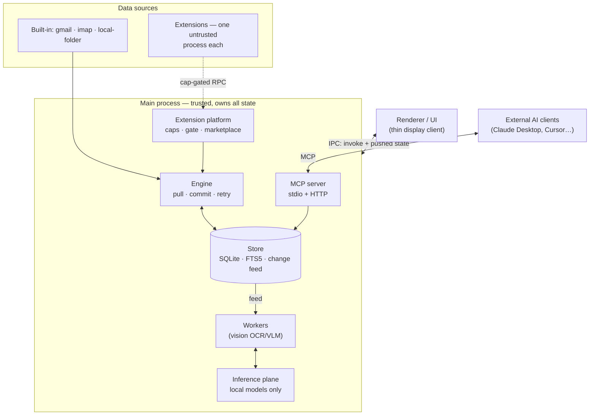

# Architecture

kia is a **local-first personal-data platform**: it continuously pulls your documents
(email, files, chats…) into one local SQLite corpus, enriches them with *local* AI
(OCR, vision), and exposes them to you (UI) and to your AI assistants (MCP).
Nothing leaves the machine.

## The big picture

Three process kinds:

| Process | Trust | Owns |
|---|---|---|
| **Main** | trusted | store, engine, scheduler, vault, inference, MCP, all enforcement |
| **Renderer** | sandboxed | display only — invokes commands, consumes one pushed state projection |
| **Extension hosts** | untrusted | one `utilityProcess` per extension; every host call re-checked main-side |

(Plus short-lived helpers: the `mcpStdio` sibling process and the `llama-server` child.)

## The ideas that shape everything

1. **One write primitive.** `Store.commit()` lands documents + cursor + status in a single
   transaction. Sources can crash anywhere; "cursor saved but data lost" cannot be written.
2. **The change feed is the integration bus.** Every commit appends a change; workers and the
   UI projection are just durable feed consumers with their own cursors. At-least-once,
   idempotent by content-hash.
3. **Everything is a plugin — built-ins included.** Gmail and the vision worker implement the
   same `Source`/`Worker`/`InferenceProvider` contracts (`src/shared/contracts.ts`) that
   extensions do. The contract file *is* the SDK.
4. **Capability-shaped trust.** Extensions run out-of-process and get a host object whose shape
   equals their granted caps; the main-side gate re-checks every call (`CAP_DENIED` + audit).
5. **Local inference only.** OCR/VLM/LLM run on-device (Apple Vision, llama.cpp); background
   work is gated by a battery/thermal-aware scheduler — the only timer authority in the app.
6. **The renderer knows nothing.** One pushed `AppState` projection, three push channels total,
   every effect an `invoke`.

## Read next

| Doc | Covers |
|---|---|
| [app-shell.md](app-shell.md) | Electron process model, IPC, renderer state, boot sequence |
| [data-pipeline.md](data-pipeline.md) | Sources → engine → store → workers → inference |
| [storage.md](storage.md) | SQLite schema, change feed, FTS, vault, invariants |
| [extension-platform.md](extension-platform.md) | Caps, the gate, extension lifecycle, marketplace |
| [mcp.md](mcp.md) | How AI clients connect; built-in + extension tools |

Deeper design history lives in [`docs/superpowers/specs/`](../superpowers/specs/) and
[`docs/rebuild/`](../rebuild/) (including `LEFTOVERS.md` — known gaps, all deliberate).
