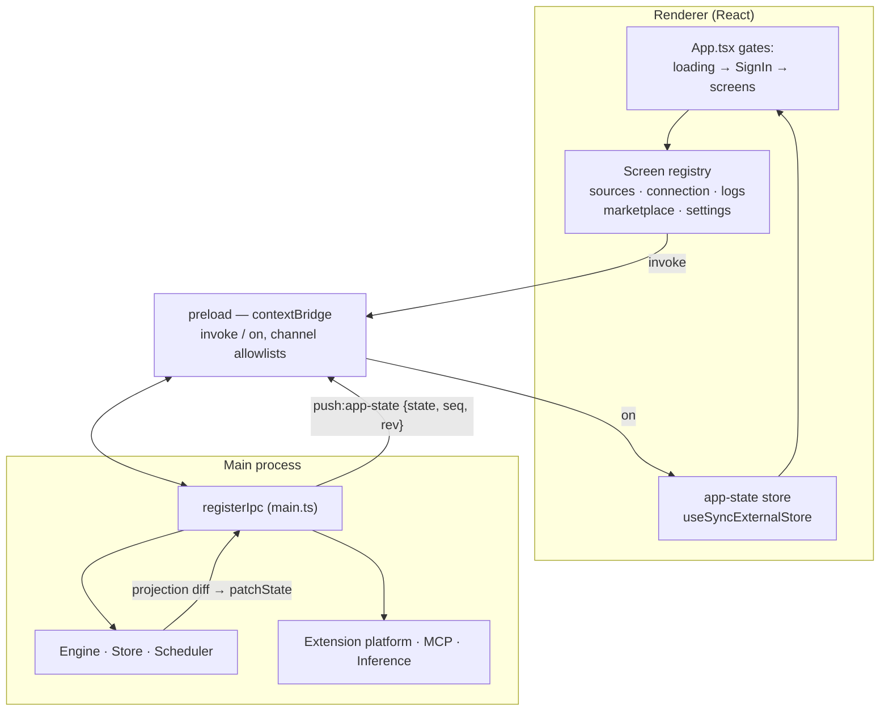

# App Shell & Renderer

The Electron process model and how the UI stays in sync.

## Trust layout

The **main process owns everything stateful and privileged**: the SQLite store, the engine and
scheduler, the credential vault, inference, extension host processes, and the MCP server. The
**renderer is a thin display client** — it never touches the DB, filesystem, or network; every
effect crosses `window.kiagent.invoke(...)`.

## IPC: two shapes only

Defined in `src/shared/ipc.ts`, enforced by runtime channel allowlists in the preload — nothing
else crosses the bridge.

- **`invoke`** (renderer → main, request/response): `accounts:*`, `search:query`, `docs:*`,
  `prefs:*`, `identity:*`, `logs:*`, `mcp:*`, `marketplace:*`, `extension:*`, maintenance, …
- **push** (main → renderer, broadcast): exactly **three channels** —
  `push:app-state`, `push:connect` (interactive connect flows), `push:logs`.
  One state channel instead of the legacy app's ~85 ad-hoc channels.

## App state: one pushed projection

`AppState = { accounts, processing, mcp, identity, prefs, extensions }`.

- The **`accounts` slice is feed-derived**: an engine projection tails the store's change feed
  and patches per-account doc counts / recent docs incrementally.
- The other slices are **latched at boot and patched imperatively** (`patchState`) — prefs
  changes, extension state changes, a 5s processing-counter tick.
- Every push carries the whole state plus `{seq, rev}`: `seq` = feed position, `rev` = monotonic
  broadcast counter. The renderer drops anything with `rev <= lastRev`; `useAppState(selector)`
  shallow-compares so unrelated slice changes don't re-render.

## Renderer

- **No router.** A `View` union (`sources | connection | logs | marketplace | settings`) maps
  through `screen-registry.tsx`; navigation is component state with a back-stack. Single window,
  no URL.
- **Two gates in `App.tsx`**: no state yet → boot splash; `identity === null` → full-screen
  SignIn. Sign-in success is entirely IPC-driven — main re-broadcasts state and the gate flips.
- **Connect flows** (adding an account) are session-scoped: `accounts:add` returns a `flowId`,
  then all interaction (prompts, OAuth status, folder picker) streams over `push:connect`.
  The renderer subscribes *before* invoking and buffers early events — sources can prompt
  synchronously before the invoke even resolves.

## Boot (condensed)

1. `bootCore()` — logs, prefs, store (SQLite), inference, scheduler, converter, engine.
2. Register bundled providers (apple-vision, local-llm) and the vision worker.
3. Start MCP; seed the first `AppStatePush` synchronously (no first-paint flash).
4. Connect broker → bundled sources → extension platform (a broken `extensions/` dir must
   never abort boot) → marketplace catalog → IPC handlers.
5. `engine.project(...)` starts the feed-tailing UI projection; `resumeAccounts()`;
   `scheduler.start()`; create the window.
6. Shutdown intercepts `before-quit` to stop the llama-server child, MCP, extension hosts, and
   close the store — in that order.

Timing discipline: the **Scheduler is the only timer authority** (30s tick, durable
`last/next_run`, battery/thermal gating). Subsystems declare cadence as data; nobody owns a
`setInterval` for recurring work.
