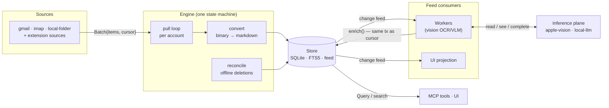

# Data Pipeline

How a document gets from an external system into the corpus, enriched, and searchable.

## Pull: sources feed the engine

A **Source** implements the contract in `src/shared/contracts.ts`: `connect(auth)` for
interactive setup, `pull(session, cursor)` as an async iterable of batches, a *pure*
`toDocument(item)`, optional `fetchBytes` and `reconcile`. The Engine
(`src/main/core/engine/engine.ts`) runs **one pull loop per account** — never two side by side.

Per account, each cycle:

1. **Trigger** — boot (`resumeAccounts`) or the Scheduler's 30s tick when a cadence job is due.
   Cadence is *data* (`{every: '15m'}`); no source owns a timer.
2. **Session** — lazily loads credentials from the vault, auto-refreshing OAuth tokens
   (< 60s to expiry). No refresh logic exists in any source.
3. **Pull** — batches are consumed abortably; each item goes through `toDocument` then
   **convert** (`engine/convert.ts`): deterministic binary → markdown (pdf-parse, mammoth,
   turndown, csv/xlsx). No inference here; text-poor content stays `markdown: null` for the
   vision worker. Raw bytes are stripped before storage.
4. **Commit** — `store.commit()`: documents + deletions + cursor + status in one transaction.
   Content-hash makes re-pulls no-ops. Each commit appends to the change feed.
5. **Reconcile** (concurrently) — sources with `reconcile()` list everything upstream; anything
   live locally but unlisted upstream is archived. A `startSeq` watermark prevents docs
   committed mid-pass from being wrongly archived.
6. **Retry** — errors back off exponentially (1s → 5min cap, 5 attempts) then park the account
   in `error` until the next trigger. Live sources (IMAP IDLE, chokidar watch) never end their
   iterable; cadence sources return and wait for the scheduler.

Built-in and extension sources register into the **same registry** — the seam is just who calls
`sources.register()` (`src/main/sources/index.ts` vs the extension platform).

## Enrich: workers tail the feed

A **Worker** is a durable feed consumer: `matches(change)` (pure) + `work(change, session)`.
The engine tails `store.feed()` from the worker's persisted cursor; delivery is **at-least-once**
so work must be idempotent.

The bundled **vision worker** (`src/main/workers/vision/`) is the pattern to copy:

- *Matches*: `attachment`/`file` docs that are PDFs/images with <16 chars of markdown and no
  `metadata.extraction` marker yet (the marker is also the re-entrancy guard — `enrich()`
  re-emits a change, and the worker must not match its own output).
- *Pass 1*: OCR every page via `session.read()` (apple-vision on macOS). Good text → `enrich()`.
- *Pass 2*: weak text + decodable image → `session.see()` (local VLM) → merged `enrich()`.
- *Outcomes*: `done` / `skip` / `defer`. `NoProviderError` (model not installed yet) → `defer`;
  a 30-minute cadence job re-drives deferred changes — and triggers the model download only when
  deferred work is actually waiting.
- `emit()`/`enrich()` output commits **atomically with the cursor advance**; a failed final
  attempt commits nothing partial.

## Inference: lanes and providers

`src/main/core/inference.ts` routes `complete` / `see` / `read` to the first *ready* registered
provider (registration order = priority). Two lanes: `interactive` always flows; `background`
blocks until the processing window is open (battery/thermal/prefs-gated by the scheduler).

- **apple-vision** (macOS): native Swift Vision helper binary — OCR (`read`) + PDF rasterizing.
- **local-llm**: curated, SHA-pinned GGUF models (sized to RAM/accelerator), resumable
  downloads, out-of-process `llama-server` with health-poll supervision and 10-min idle stop.

Nothing leaves the machine: all inference is local.

## Out: query surface

Everything downstream reads through `Query` (`document`, `children`, `byExternalId`, `search`,
`count`, `accounts`) — the renderer via IPC, MCP tools, and `query`-capped extensions all share
the exact same read surface. See [storage.md](storage.md) for schema and search details.
