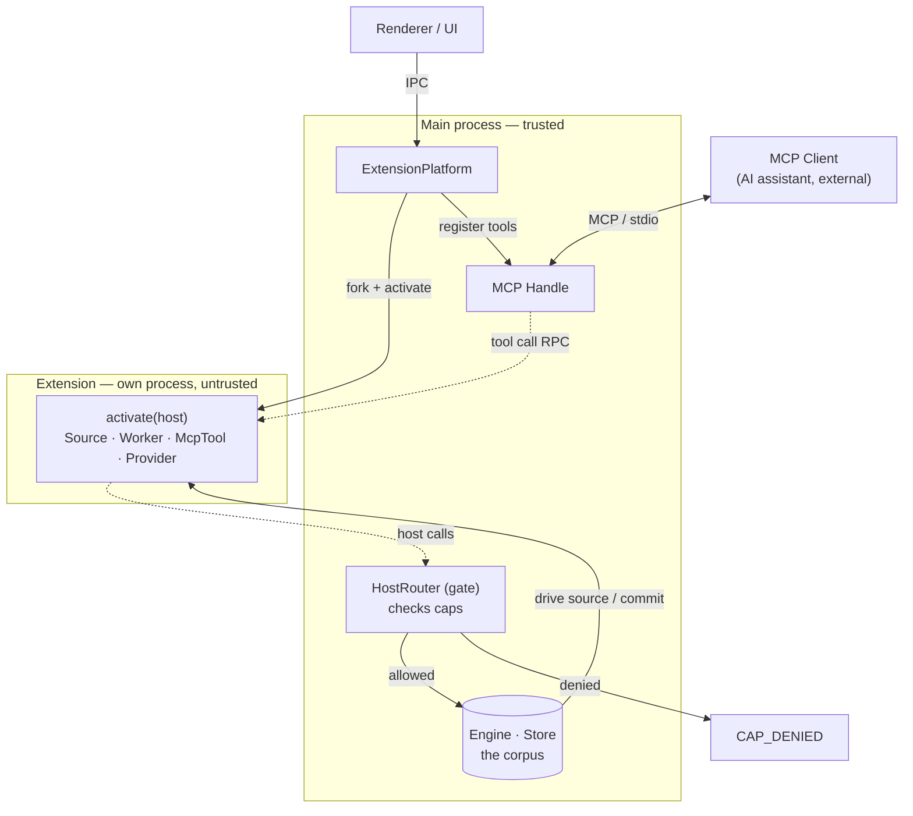
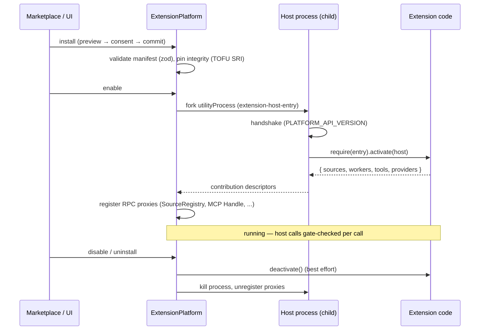

# Extension Platform

How third-party code runs inside kia without being trusted.

## The model in one paragraph

Every enabled extension runs in **its own OS process** (an Electron `utilityProcess`; `child_process.fork` in tests). No extension code ever runs in the main process. The extension declares **capabilities** (`caps`) in its manifest; at runtime it receives a `host` object whose *shape is its grants* — a namespace it wasn't granted simply doesn't exist on the object. Every host call crosses back into the main process over RPC, where the **HostRouter (the gate)** re-checks the grant before touching anything real. Denied calls throw `CAP_DENIED` and write a `permission-violation` audit log.



## The contract IS the SDK

There is no published npm SDK. The extension-facing API is §7 of
[`src/shared/contracts.ts`](../../src/shared/contracts.ts) — extensions vendor a snapshot of it
(e.g. as `src/kiagent-contracts.ts`) and compile against it. The platform checks the manifest's
`engine` semver range against `PLATFORM_API_VERSION` (`src/shared/extension-rpc.ts`).

An extension is a CJS bundle whose default export is:

```ts
const extension: ExtensionModule<Caps> = {
  async activate(host) {
    // host has ONLY the namespaces you declared in caps
    return { sources: [...], workers: [...], tools: [...], providers: [...] };
  },
  async deactivate() { /* optional */ },
};
```

**Contributions are return values, not registrations.** `activate()` returns contributions; the
main process wraps each in an RPC proxy and registers the proxy into the real registries
(SourceRegistry, MCP Handle). The extension never holds a reference to anything trusted.

> Note: the contract type allows `{ sources, workers, tools, providers }`, but the wire protocol
> (`Contributions` in `extension-rpc.ts`) currently carries **sources and tools only** — extension
> workers/providers are declared-but-not-yet-plumbed. Only built-ins register those today.

## Capabilities

Eight caps, each mapping 1:1 to a host namespace (`CapSurfaces` in contracts.ts):

| Cap | Host surface | Grants |
|---|---|---|
| `query` | `host.query` | Read the corpus: `document`, `children`, `byExternalId`, `search`, `count`, `accounts` |
| `net` | `host.net.fetch` | Outbound HTTP |
| `files` | `host.files` | Scoped file access: `list`, `read`, `write`, `move` — *declared in the contract, rejected at runtime today* |
| `db` | `host.db` | A **private** SQLite db (`private.db` in the extension's data dir): `exec`, `query` — never the shared store |
| `ui` | `host.ui.notify` | User notifications |
| `commands` | `host.commands.register` | Register invokable commands — *declared in the contract, rejected at runtime today* |
| `inference` | `host.inference` | Local AI: `complete`, `see`, `read` |
| `events` | `host.events` | Cross-extension pub/sub: `on`, `emit` |

Always present, no cap needed: `host.self` (`id`, `dataDir`) and `host.log(level, msg)`.
Real implementations live in `src/main/platform/host-surfaces.ts`.

Two things worth internalizing:

- **No `db.write` to the shared store exists at all.** Extensions get data into the corpus only
  by *returning* it — Source pull batches and Worker emissions that the Engine validates and
  commits. The write path is structurally owned by trusted code.
- **Caps are a cooperative contract + audit surface, not OS containment.** The child process can
  still `require('fs')`. The hard gates are install-time (integrity pin, path containment,
  manifest validation) and the main-side check on every host call. This honesty is deliberate —
  see the design spec.

## Lifecycle



Sources contributed by extensions are **demand-driven**: the main-side proxy sends `src-next`,
the child advances the async iterator exactly one step, and replies `src-batch` / `src-done` /
`src-error`. The Engine's backpressure applies to extension sources for free.

## Runtime files

| File | Role |
|---|---|
| `src/main/platform/extension-platform.ts` | Orchestrator: per-extension state machine (disabled → activating → activated / needs-consent / errored), install/uninstall/consent, wires contributions into registries |
| `src/main/platform/extension-host-entry.ts` | Child bootstrap: loads bundle via `createRequire`, runs `activate`, dispatches tool/source calls |
| `src/main/platform/host-process.ts` | Per-extension process supervisor: fork → handshake → activate; crash-loop breaker (3 crashes / 60s) |
| `src/main/platform/host-router.ts` | **The gate**: namespace → cap table, `granted: ReadonlySet<Cap>`, throws `CAP_DENIED`, audit log |
| `src/main/platform/host-surfaces.ts` | Real implementations behind each cap namespace |
| `src/main/platform/manifest.ts` | zod manifest validation; unknown caps rejected; legacy manifests rejected; `engine` semver check; entry containment |
| `src/main/platform/extensions.ts` | Disk state only: `installed.json`, `state.json`, manifest-only discovery — never loads extension code |
| `src/main/platform/oauth-providers.ts` | OAuth provider profiles/refreshers (e.g. `google`) — client secrets stay main-side |
| `src/main/platform/source-proxy.ts` | Demand-driven Source proxying (`src-next` / `src-batch`) |
| `src/main/platform/transport.ts` | `utilityProcess` / `fork` / in-memory transports + symmetric RPC endpoint |
| `src/shared/extension-rpc.ts` | Wire message unions, bootstrap handshake, `PLATFORM_API_VERSION` |

## Marketplace

The catalog is a GitHub org query (`org:kia-plugins topic:kia-plugin`). Install is three-phase
(two IPC calls, with the consent modal in between on the renderer side):

1. **Preview** (`extension:install-preview`) — download tarball, verify/pin integrity
   (TOFU sha512 SRI; plaintext `http:` refs rejected), staged extract, validate manifest,
   check source-id collisions. No extension code executes.
2. **Consent** — the renderer shows the cap list from the preview; the user approves.
3. **Commit** (`extension:install-commit`) — move staging into `extensions/<id>` (preserving
   `data/`), record the consent row (append-only, in the store), hot-activate.

Re-installing the same id+version with different bytes is rejected against the pinned integrity.
Files: `src/main/marketplace/{catalog,github-source,github-cache,github-ref,installer,update-check}.ts`;
the IPC handlers live inline in `src/main/main.ts`.

Authoritative design doc: [`docs/superpowers/specs/2026-07-03-extension-marketplace-design.md`](../superpowers/specs/2026-07-03-extension-marketplace-design.md).
