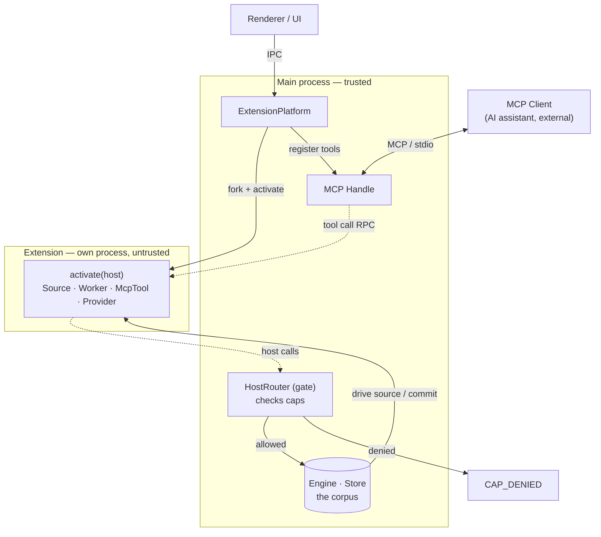
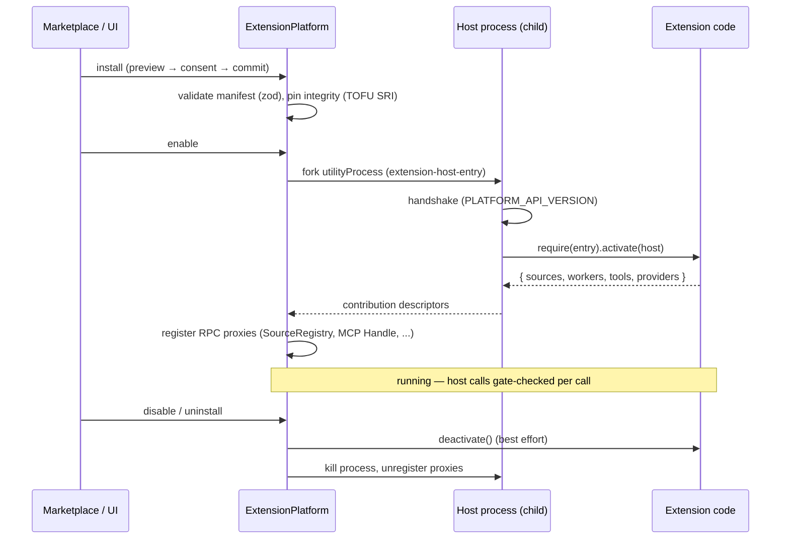

# Extension Platform

How third-party code runs inside kia without being trusted.

## The model in one paragraph

Every enabled extension runs in **its own OS process** (an Electron `utilityProcess`; `child_process.fork` in tests). No extension code ever runs in the main process. The extension declares **capabilities** (`caps`) in its manifest; at runtime it receives a `host` object whose _shape is its grants_ — a namespace it wasn't granted simply doesn't exist on the object. Every host call crosses back into the main process over RPC, where the **HostRouter (the gate)** re-checks the grant before touching anything real. Denied calls throw `CAP_DENIED` and write a `permission-violation` audit log.



## The contract IS the SDK

There is no published npm SDK. The extension-facing API is §7 of
[`src/shared/contracts.ts`](../../src/shared/contracts.ts) — extensions vendor a snapshot of it
(e.g. as `src/kiagent-contracts.ts`) and compile against it. The platform checks the manifest's
`engine` semver range against `PLATFORM_API_VERSION` (`src/shared/extension-rpc.ts`).

An extension is a CJS bundle whose default export is:

```ts
const extension: ExtensionModule<Caps> = {
  async activate(host) {
    // host has ONLY the namespaces you declared in caps
    return { sources: [...], workers: [...], tools: [...], providers: [...] };
  },
  async deactivate() { /* optional */ },
};
```

**Contributions are return values, not registrations.** `activate()` returns contributions; the
main process wraps each in an RPC proxy and registers the proxy into the real registries
(SourceRegistry, MCP Handle). The extension never holds a reference to anything trusted.

> Note: the contract type allows `{ sources, workers, tools, providers }`, but the wire protocol
> (`Contributions` in `extension-rpc.ts`) currently carries **sources and tools only** — extension
> workers/providers are declared-but-not-yet-plumbed. Only built-ins register those today.

## Capabilities

Eight caps, each mapping 1:1 to a host namespace (`CapSurfaces` in contracts.ts):

| Cap         | Host surface             | Grants                                                                                                       |
| ----------- | ------------------------ | ------------------------------------------------------------------------------------------------------------ |
| `query`     | `host.query`             | Read the corpus: `document`, `children`, `byExternalId`, `search`, `count`, `accounts`                       |
| `net`       | `host.net.fetch`         | Outbound HTTP                                                                                                |
| `files`     | `host.files`             | Scoped file access: `list`, `read`, `write`, `move` — _declared in the contract, rejected at runtime today_  |
| `db`        | `host.db`                | A **private** SQLite db (`private.db` in the extension's data dir): `exec`, `query` — never the shared store |
| `ui`        | `host.ui.notify`         | User notifications                                                                                           |
| `commands`  | `host.commands.register` | Register invokable commands — _declared in the contract, rejected at runtime today_                          |
| `inference` | `host.inference`         | Local AI: `complete`, `see`, `read`                                                                          |
| `events`    | `host.events`            | Cross-extension pub/sub: `on`, `emit`                                                                        |

Always present, no cap needed: `host.self` (`id`, `dataDir`) and `host.log(level, msg)`.
Real implementations live in `src/main/platform/host-surfaces.ts`.

Two things worth internalizing:

- **No `db.write` to the shared store exists at all.** Extensions get data into the corpus only
  by _returning_ it — Source pull batches and Worker emissions that the Engine validates and
  commits. The write path is structurally owned by trusted code.
- **Caps are a cooperative contract + audit surface, not OS containment.** The child process can
  still `require('fs')`. The hard gates are install-time (integrity pin, path containment,
  manifest validation) and the main-side check on every host call. This honesty is deliberate —
  see the design spec.

## Lifecycle



Sources contributed by extensions are **demand-driven**: the main-side proxy sends `src-next`,
the child advances the async iterator exactly one step, and replies `src-batch` / `src-done` /
`src-error`. The Engine's backpressure applies to extension sources for free.

## Runtime files

| File                                        | Role                                                                                                                                                                    |
| ------------------------------------------- | ----------------------------------------------------------------------------------------------------------------------------------------------------------------------- |
| `src/main/platform/extension-platform.ts`   | Orchestrator: per-extension state machine (disabled → activating → activated / needs-consent / errored), install/uninstall/consent, wires contributions into registries |
| `src/main/platform/extension-host-entry.ts` | Child bootstrap: loads bundle via `createRequire`, runs `activate`, dispatches tool/source calls                                                                        |
| `src/main/platform/host-process.ts`         | Per-extension process supervisor: fork → handshake → activate; crash-loop breaker (3 crashes / 60s)                                                                     |
| `src/main/platform/host-router.ts`          | **The gate**: namespace → cap table, `granted: ReadonlySet<Cap>`, throws `CAP_DENIED`, audit log                                                                        |
| `src/main/platform/host-surfaces.ts`        | Real implementations behind each cap namespace                                                                                                                          |
| `src/main/platform/manifest.ts`             | zod manifest validation; unknown caps rejected; legacy manifests rejected; `engine` semver check; entry containment                                                     |
| `src/main/platform/extensions.ts`           | Disk state only: `installed.json`, `state.json`, manifest-only discovery — never loads extension code                                                                   |
| `src/main/platform/oauth-providers.ts`      | OAuth provider profiles/refreshers (e.g. `google`) — client secrets stay main-side                                                                                      |
| `src/main/platform/source-proxy.ts`         | Demand-driven Source proxying (`src-next` / `src-batch`)                                                                                                                |
| `src/main/platform/transport.ts`            | `utilityProcess` / `fork` / in-memory transports + symmetric RPC endpoint                                                                                               |
| `src/shared/extension-rpc.ts`               | Wire message unions, bootstrap handshake, `PLATFORM_API_VERSION`                                                                                                        |

## Marketplace

The catalog is a GitHub org query (`org:kia-plugins topic:kia-plugin`). Install is three-phase
(two IPC calls, with the consent modal in between on the renderer side):

1. **Preview** (`extension:install-preview`) — download tarball, verify/pin integrity
   (TOFU sha512 SRI; plaintext `http:` refs rejected), staged extract, validate manifest,
   check source-id collisions. No extension code executes.
2. **Consent** — the renderer shows the cap list from the preview; the user approves.
3. **Commit** (`extension:install-commit`) — move staging into `extensions/<id>` (preserving
   `data/`), record the consent row (append-only, in the store), hot-activate.

Re-installing the same id+version with different bytes is rejected against the pinned integrity.
Files: `src/main/marketplace/{catalog,github-source,github-cache,github-ref,installer,update-check}.ts`;
the IPC handlers live inline in `src/main/main.ts`.

Authoritative design doc: [`docs/superpowers/specs/2026-07-03-extension-marketplace-design.md`](../superpowers/specs/2026-07-03-extension-marketplace-design.md).

## Bundled extensions (privileged tier)

A second, optional discovery root lets a **product build** ship extensions
inside the app package itself, alongside the marketplace/dev-installed ones
in `extDir`. It's wired via `ExtensionPlatformDeps.bundledDir` — `main.ts`
resolves it from `product.bundledExtensionsDir` (default
`'bundled-extensions'`) under the resource root; see "Product builds" below.
OSS with no product config still passes a `bundledDir` — it just points at a
directory that doesn't exist, so the bundled scan finds nothing and behavior
is exactly as before.

### Discovery and `origin: 'bundled'`

`ExtensionPlatform.start()` scans `bundledDir` (if set) with
`discoverExtensions(dir, { tier: 'bundled' })` _after_ scanning `extDir`.
Each found entry is tagged `origin: 'bundled'` and gets special treatment:

- **Manifest tier `'bundled'`.** `parseManifest`/`validateManifestDir` take
  an `opts.tier: 'external' | 'bundled'`. Only manifests validated at tier
  `'bundled'` may declare privileged caps (today just `unsafe.mainProcess`,
  `PRIVILEGED_CAPS` in `manifest.ts`); an external manifest declaring one is
  a hard `ManifestError` at parse time: _"this extension requires
  unsafe.mainProcess — only extensions bundled with the app may use it"_.
- **Auto-consent.** `activate()` skips the consent check entirely for
  `origin === 'bundled'` (`e.origin !== 'bundled' && !(await
consentCovers(...))`). Trust model: consent is a proxy for "the user chose
  to install this"; a bundled extension was never installed — it shipped
  inside the signed app bundle the user already trusted by installing the
  app. There's no separate approval step, ever.
- **No uninstall, no marketplace replace.** `uninstall()` and
  `installCommit()` reject any id whose live entry has `origin ===
'bundled'` with a user-facing error ("bundled extensions are part of the
  app and cannot be uninstalled" / "...cannot be replaced from the
  marketplace"). A bundled extension _can_ still be disabled
  (`setEnabled(id, false)`) — disable is not uninstall, and `setEnabled` has
  no origin check.
- **Bundled-wins shadowing.** If a bundled id collides with an id already
  discovered from `extDir` (installed/dev), the bundled copy overwrites the
  entry and a warning is logged: _"bundled extension `<id>` shadows an
  installed copy — bundled wins — the installed copy remains on disk and is
  ignored"_. This is boot-time precedence, not a merge — whichever
  manifest/entry the bundled scan found is what runs; the shadowed copy is
  never deleted, just never loaded.
- **`origin` is clamped, never trusted verbatim from disk.** `installed.json`
  is untrusted input (a bare `JSON.parse` cast, no schema validation) — a
  hand-edited record claiming `origin: 'bundled'` must never grant an
  `extDir` extension the auto-consent bypass above. Both Entry-construction
  sites read a record's origin through a clamp that only ever yields
  `'marketplace'` or `'dev'`; `'bundled'` is assigned exclusively by the
  bundled-discovery loop itself, never from a record.
- **dataDir lives outside the app bundle.** Every extension's
  `host.self.dataDir` normally sits at `<extDir-entry>/data`, but a bundled
  extension's install dir is inside the (signed, possibly read-only,
  update-replaced) app package, so it can never double as mutable storage.
  `origin === 'bundled'` entries instead get
  `<bundledDataDir>/<extensionId>`, where `bundledDataDir` defaults to a
  `bundled-extensions-data` directory sibling of `extDir` and is overridable
  via `ExtensionPlatformDeps.bundledDataDir` (`main.ts` points it at
  `userData/bundled-extensions-data`).
- **Marketplace UI.** The catalog row/detail subtitle gets a `· bundled`
  suffix (alongside the existing `· dev install`) and the Uninstall button
  is hidden when `origin === 'bundled'` (`src/renderer/screens/Marketplace/{rows.ts,Detail.tsx}`).

### The `unsafe.mainProcess` cap

The one privileged cap defined so far. It is **not** a host namespace —
`CapSurfaces['unsafe.mainProcess']` is `{}`, and the child runtime's
`NS_METHODS` table (`extension-host-entry.ts`) has no entry for it, so it
never appears on `host` itself. Instead:

- Declaring it in `caps` marks the manifest privileged (rejected outside
  tier `'bundled'`, see above).
- It also selects the transport: `ExtensionPlatform.activate()` checks
  `e.manifest.caps.includes('unsafe.mainProcess')` and, if true, runs the
  extension **in-process** (next section) instead of forking a
  `utilityProcess`/`child_process.fork` host.
- If the platform was given a `mainApi`
  (`ExtensionPlatformDeps.mainApi` — Stage 1 wires the plumbing only and
  `main.ts` never sets it yet; Stage 2 defines the real handle) _and_ the
  extension declared the cap, `activate(host, extras)` receives `extras =
{ mainProcess: mainApi }` as its second argument. Otherwise `extras` is
  `undefined` — including always for out-of-process (forked) children,
  which never receive `mainApi` regardless of caps.
- Consent copy (`CAP_CATALOG['unsafe.mainProcess']`,
  `src/renderer/components/cap-catalog.ts`): label _"Full app access
  (bundled only)"_, risk `elevated`, icon `settings` — _"Runs inside the app
  process with unrestricted access to it. Only extensions shipped as part
  of the app itself can use this."_
- **Explicitly unstable — a temporary escape hatch.** It exists so a
  first-party bundled extension can reach real main-process internals
  before the platform grows a proper capability for whatever it needs
  (identity, extension storage/schema, UI slots — later-stage work). Every
  escape-hatch usage is expected to migrate to a real cap and the hatch
  itself to be deleted; it is not meant to become a general "trust me" cap
  — the manifest tier already forecloses third-party use, since only
  extensions validated at tier `'bundled'` (i.e. shipped inside the signed
  app bundle) may ever declare it.

### In-process semantics (vs. a forked child)

For `unsafe.mainProcess` extensions, `activate()` builds an in-memory
transport pair (`createInMemoryHostPair()`) instead of forking, and drives
the _same_ child-runtime code (`runExtensionHost` from
`extension-host-entry.ts`) directly inside the main process, over that
pair. Two real differences remain, and one that looked like a difference is
neutralized:

1. **The kill backstop is inert.** The primary stop path — the platform
   sends a `'deactivate'` message, the extension's own `deactivate()` runs,
   then the host exits — is identical to the forked tier. Only the
   _backstop_ differs: a forked child that ignores/outlives its deactivate
   gets OS-killed; an in-process extension's `exit` is wired to
   `pair.simulateExit(code)`, which only tells the supervisor "this host
   exited" — it cannot terminate anything. A timer or listener a
   misbehaving bundled extension leaks keeps running in the main process.
   Consequence for authors: `deactivate()` must actually tear down what you
   started — the platform cannot force it for you.
2. **No process boundary for exceptions.** An uncaught exception or
   unhandled rejection in extension async code hits the main process
   directly — there's no child process to crash instead. Acceptable because
   bundled tier is first-party trusted code by definition; this is not a
   hardening gap for third-party extensions, which always run
   out-of-process.
3. **Neutralized: require-cache persistence.** A naive in-process re-run
   would keep the extension's module (and any module-level state) alive
   across disable→enable, since Node's module cache doesn't know the
   extension "left". This is fixed on exit:
   `pair.main.onExit(() => bustRequireCacheUnder(realDir))` deletes every
   `Module._cache` entry keyed under the extension directory's **real,
   symlink-resolved** path (`fs.realpathSync(e.dir)` — needed because e.g.
   macOS's `os.tmpdir()` is itself a symlink, `/var/folders` →
   `/private/var/folders`, so comparing against the raw directory would
   silently never match). The loader used to `require` the entry,
   `loadExtensionModule()`, goes through Node's real `Module._load`
   primitive for the matching reason: under this repo's jest runtime,
   `createRequire(...).cache` is an ephemeral snapshot that recomputes on
   each access (deletions don't stick), and a bare `require`'s `.cache` is
   consulted by jest's own instrumented module registry, not Node's —
   evicting either one does _not_ make a later `require()` reload under
   jest (verified empirically). `Module._load`/`Module._cache` are the
   lower-level primitives `require()` itself is built on, and are real and
   mutable under both jest and plain Node/webpack (this static `import
NodeModule from 'module'` in `extension-platform.ts` is never touched by
   webpack's bundle-scoped require rewriting, since `target:
'electron-main'` externalizes the `module` built-in). Net effect:
   disable→enable loads a fresh module instance, same as a forked child
   getting a fresh process. Documented boundary: the cache-bust is
   **directory-scoped** — module state held in transitive requires
   _outside_ the extension's own directory (e.g. a shared singleton inside
   a core module the extension imported) survives re-activation, because
   only the extension-dir path prefix is evicted.

The two real differences (1 and 2) are meant to retire once a later stage
lands real capabilities for whatever a given bundled extension needs and it
stops declaring `unsafe.mainProcess` — it either moves out-of-process like
every other extension, or the escape hatch itself is deleted once unused.
The require-cache fix (3) is a permanent property of the in-process host,
not a temporary trade-off.

### Product builds

A **product build** is a bundled-extensions consumer with its own brand
identity: `product.json`, resolved by `loadProductConfig()`
(`src/main/product.ts`). Fields — all optional, and the schema is
`.strict()` (an unknown key rejects the whole file):

| Field                  | Type         | Effect                                                                                                                         |
| ---------------------- | ------------ | ------------------------------------------------------------------------------------------------------------------------------ |
| `productName`          | string       | User-facing product name — today only `Notification` titles in `main.ts` read it.                                              |
| `updateFeedUrl`        | string (URL) | Reserved for update-feed wiring; not yet consumed anywhere.                                                                    |
| `bundledExtensionsDir` | string       | Overrides the bundled-extensions directory name/path (default `'bundled-extensions'`), resolved relative to the resource root. |

`loadProductConfig(candidates, log?)` **never throws**: it takes the first
candidate whose `product.json` exists (a candidate ending in `.json` is
used as a literal file path; anything else has `product.json` appended),
parses it, and falls back to `DEFAULT_PRODUCT = { productName: 'KIAgent' }`
on a missing file, parse error, or schema violation (logging the reason via
the optional `log` callback on error, never throwing). `main.ts` calls it
with `[process.env.KIA_PRODUCT_CONFIG, app.isPackaged ?
process.resourcesPath : null, app.getAppPath()]` — so `KIA_PRODUCT_CONFIG`
(a directory or a `.json` file path) always wins if set, then the packaged
resources dir, then the dev app path. The resolved
`product.bundledExtensionsDir` (or the default) is what feeds
`ExtensionPlatformDeps.bundledDir` above.

An OSS checkout with no `product.json` anywhere in the candidate list runs
on `DEFAULT_PRODUCT` and (absent a populated `bundled-extensions/`
directory) has nothing for the bundled scan to find — the whole privileged
tier is dormant unless a product build supplies both the config and the
extensions.
