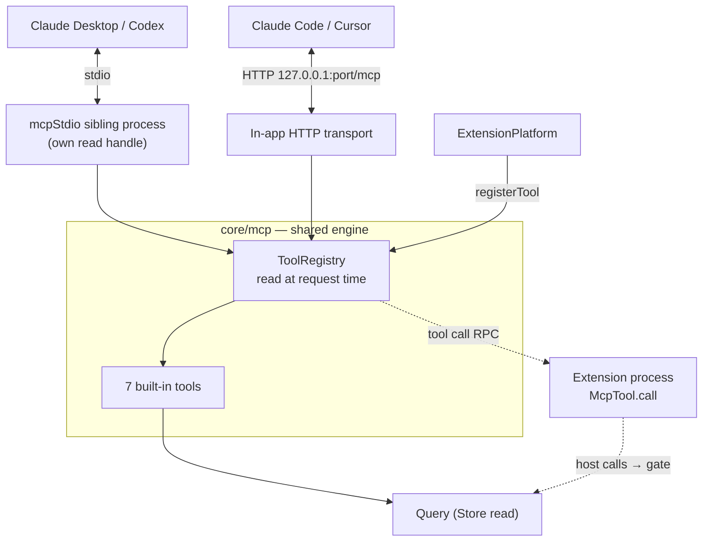
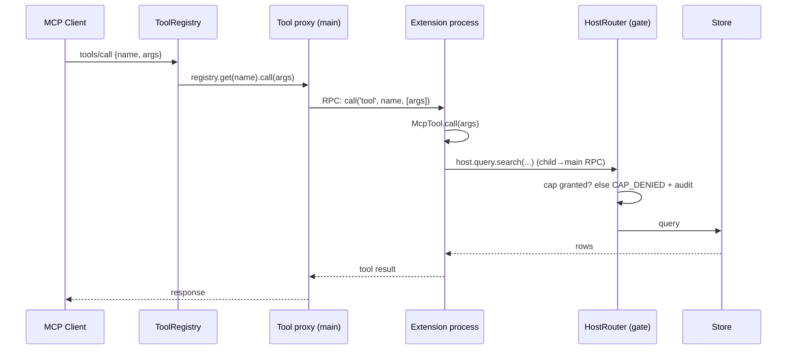

# MCP Surface

How external AI clients (Claude Desktop, Claude Code, Cursor, Codex…) read the corpus.

## One engine, two transports

There are two `mcp` directories, and the split is the whole design:

- **`src/main/core/mcp/`** — the Electron-free *engine*: server identity (`make-server.ts`),
  the mutable **ToolRegistry** + dispatch (`registry.ts`), the built-in tools (`tools/`),
  `doc://{id}` resources, and client-config writers (`clients.ts`).
- **`src/main/mcp/stdio-entry.ts`** — a *standalone sibling process* that stdio clients spawn
  directly (`ELECTRON_RUN_AS_NODE=1 <app> mcpStdio.js --db <path>`). No window, no single-instance
  lock; it opens its own read handle on the same SQLite file.
- The running app additionally serves **Streamable HTTP** on `http://127.0.0.1:<port>/mcp`
  (`core/mcp/server.ts`) — loopback bind *is* the auth; no bearer token.

Both transports import the same registry and tools, so the two surfaces cannot drift. The
"Connect" button writes the right client config for you: stdio descriptors for Claude
Desktop/Codex, HTTP entries for Claude Code/Cursor/VS Code.

> Note: `query_sql` and `get_schema` (tier `powerful`) bypass the `Query` path — they read through their own read-only SQLite handle owned by `raw-sql.ts`.

## Built-in tools

Defined in `src/main/core/mcp/tools/`. Five are `tier: 'standard'`; `query_sql` and `get_schema`
are `tier: 'powerful'`:

| Tool | Does |
|---|---|
| `search` | Full-text/boolean search with source/type/date filters, batch mode, snippets |
| `get` | Fetch document(s) by id — full markdown + metadata |
| `count` | Aggregate counts (`group_by: source`) |
| `get_related` | Thread messages, attachments, children, parent of a doc |
| `digital_memory_info` | Discovery: accounts, counts by source/type/language, date range |
| `query_sql` | Read-only raw SQL (`SELECT`/`WITH` only, textual gate + readonly driver handle), capped at 500 rows |
| `get_schema` | Markdown schema doc (tables, columns, relations) — read this before writing `query_sql` |

`query_sql` and `get_schema` ship on both the HTTP and stdio transports (`tools/raw-sql.ts`).
They are read-only, not sandboxed by a consent prompt — the `'powerful'` tier concept is
reserved for that, but the gate is deferred, not built. **`tier` is unenforced wire metadata
today** (exposed in `_meta.tier` on `tools/list` for a future in-app gate); don't assume runtime
gating exists.

## Extension tools

An extension's `activate()` returns `tools`; the platform registers a proxy whose `call` RPCs
into the extension's process. Because the registry is read at *request* time, tools appear to
already-connected clients immediately — no reconnect needed.

Every call — built-in or proxied — is audited: `mcp.call` log with args, ok/error, duration.

Details on the extension side: [extension-platform.md](extension-platform.md).
