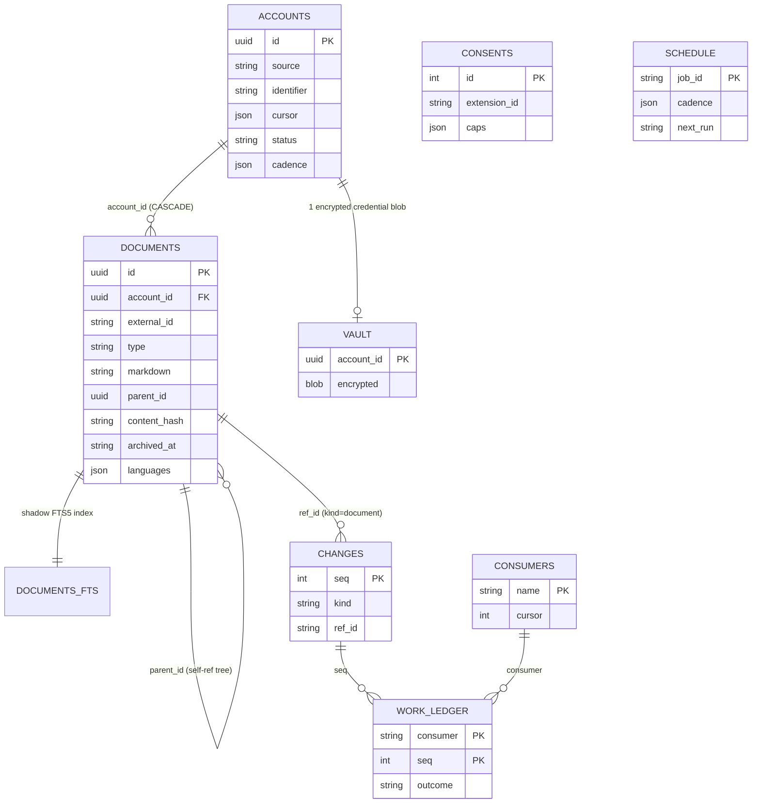

# Storage

One SQLite file (`better-sqlite3`, WAL mode) at `userData/data/kiagent.db` owns everything:
documents, the change feed, credentials, consents, and scheduler state. The Store
(`src/main/core/store/store.ts`) is the only code that touches it.

## Schema

(Not shown: `meta` — schema version + user identity k/v.)

## The rules that matter

- **One write primitive.** `Store.commit(CommitBatch)` lands documents + deletions + cursor +
  status in a *single transaction*. "Cursor saved but rows not committed" cannot be written.
- **Idempotency by natural key.** Documents are `UNIQUE(account_id, external_id, type)`;
  a `content_hash` short-circuit makes re-pulling unchanged items a no-op with no feed churn.
  Sources can be dumb and re-send everything.
- **The feed is the integration point.** Every commit appends to `changes` (append-only,
  AUTOINCREMENT `seq`). Workers and UI projections tail `store.feed(cursor)`; their cursor
  lives in `consumers` and advances *in the same transaction* as their output. Feed rows have
  log-compaction semantics: `document`/`account` rows re-read *current* state at delivery time;
  `purge`/`accountRemoved` are tombstones.
- **FTS is never stale.** `documents_fts` (FTS5, bm25 with title weighted 4×) is updated inside
  the same transaction as the row it indexes. Search text goes through a small hand-rolled
  boolean DSL (`AND`/`OR`/`NOT`, phrases, `prefix*`) compiled to a quoted MATCH expression —
  raw FTS5 syntax is never injected.
- **Soft delete.** Archiving sets `archived_at`; queries exclude archived by default. Hard purge
  exists as a commit arm (`purgeArchived`) but no scheduled job calls it yet.
- **Credentials are sealed.** OAuth tokens live in `vault` as `safeStorage`-encrypted blobs, one
  per account. Sources never see refresh logic — `Session.credentials()` refreshes centrally.
- **Consents are append-only.** Extension cap grants land in `consents`; latest row per
  extension wins. It's an audit trail, not a settings table.
- **UUIDv7 everywhere.** Time-ordered primary keys for b-tree locality (`src/main/core/ids.ts`).

## Search

FTS5 only — **no vector/embedding index** in this build (deliberately dropped from the legacy
system). `Query.search` ranks by bm25; without query text it falls back to recency ordered by
*origin* date (`created_at`), not write order, so newest-first backfills don't invert results.

## Known gaps (by design, tracked in `docs/rebuild/LEFTOVERS.md`)

- `src/main/db/worker-entry.ts` is a stub — SQLite still runs on the Electron main thread;
  big transactions can block IPC. Moving the store to a `worker_threads` worker is planned.
- `needsReauth` status exists in the contract but nothing flips an account into it yet.
- No scheduled retention job invokes `purgeArchived`.
